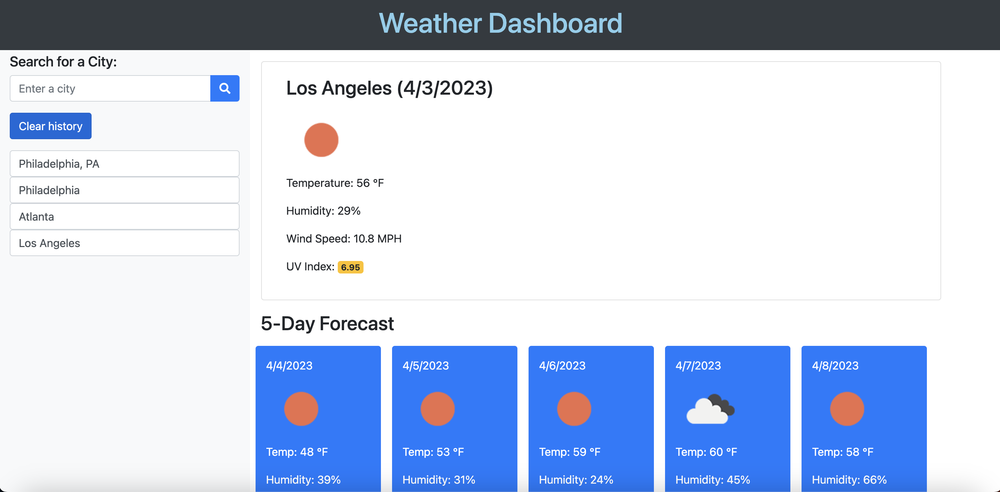

# Weather-Dashboard

A weather dashboard that allows users to search for a city, and be given a 5-day weather forecast, while displaying an icon related to the weather for each date. Above the 5-day forecast displays the current date with a more in depth analysis, including wind speed and UV Index.

Allows the user to easily click on previously searched cities, and be given its 5-day weather forecast again, without having to search the city again. 

If user wants to clear their search history, they're able to do so by clicking the "Clear history" button located under where they search by city.

